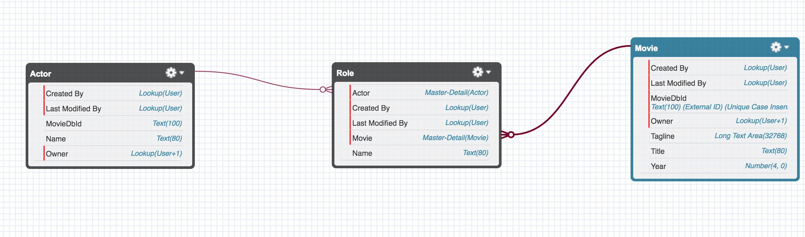

# MovieQL

[](https://travis-ci.com/rricard/movieql)

---

Graphql+Salesforce -based React Native Movie Application

This app is featured in a Dreamforce 2016 talk: [Leverage GraphQL to Efficiently Query Data Relationships in Salesforce](https://success.salesforce.com/Sessions?eventId=a1Q3000000qQOd9#/session/a2q3A000000LBekQAG)


----

MovieQL is a project handling both React Native client and the GraphQL server.

The root of the project is the React Native app, while what's in `/data` is the GraphQL schema server.

## Installation

You will need to setup Node 6+ and [React Native](https://facebook.github.io/react-native/docs/getting-started.html#content) first.

Then you have to choose how to run this:

- Run it from the public [MovieQL heroku endpoint](https://movieql.herokuapp.com/graphiql)
- Run it from your own Salesforce Org configured for MovieQL

### Clone the repository

First, you need to get the code!

```
git clone https://github.com/rricard/movieql.git
cd movieql
```

### Install the dependencies

```
npm install
```

### Use the public endpoint

**Skip this step if you use your own Salesforce setup**

You need to change the code to point to the public endpoint in every case:

`app/client.js`

```diff
- const GRAPHQL_ENDPOINT = __DEV__ ? 'http://localhost:3000/graphql' : 'https://movieql.herokuapp.com/graphql';
+ const GRAPHQL_ENDPOINT = 'https://movieql.herokuapp.com/graphql';
```

### Configure the Salesforce Org.

**Skip this step if you use the public endpoint**

You will need to setup the following custom objects in Salesforce (using the Schema Builder):



Once it is done, populate some Movie, Actor and Role in Salesforce, correctly linking them to numeric MovieDB IDS.

> **Example**: Reservoir Dogs has the following url on MovieDB: https://www.themoviedb.org/movie/500-reservoir-dogs?language=en. In this URL, the ID is _500_.

### Get auth to Salesforce and MovieDB

**Skip this step if you use the public endpoint**

Create a `.env` file in the repository directory with the following contents:

```
MOVIE_DB_TOKEN=<Get this token on https://www.themoviedb.org/documentation/api>
SFDC_USERNAME=<enter your salesforce email used for login>
SFDC_PWD_AND_TOKEN=<enter your salesforce password><security token - help here: https://help.salesforce.com/HTViewHelpDoc?id=user_security_token.htm>
```

## Run!

### Start the GraphQL server

**Skip this step if you use the public endpoint**

Now everything is ready to start!

```
npm start
```

### Start the React Native server

```
npm run rn-start
```

### Start the App on iOS

```
react-native run-ios
```

### Start the App on Android

```
react-native run-android
```

## Run code checks

### Static Typechecking (flow)

```
./node_modules/.bin/flow
```

### Unit tests

```
npm test
```

### Linter

```
npm run lint
```
